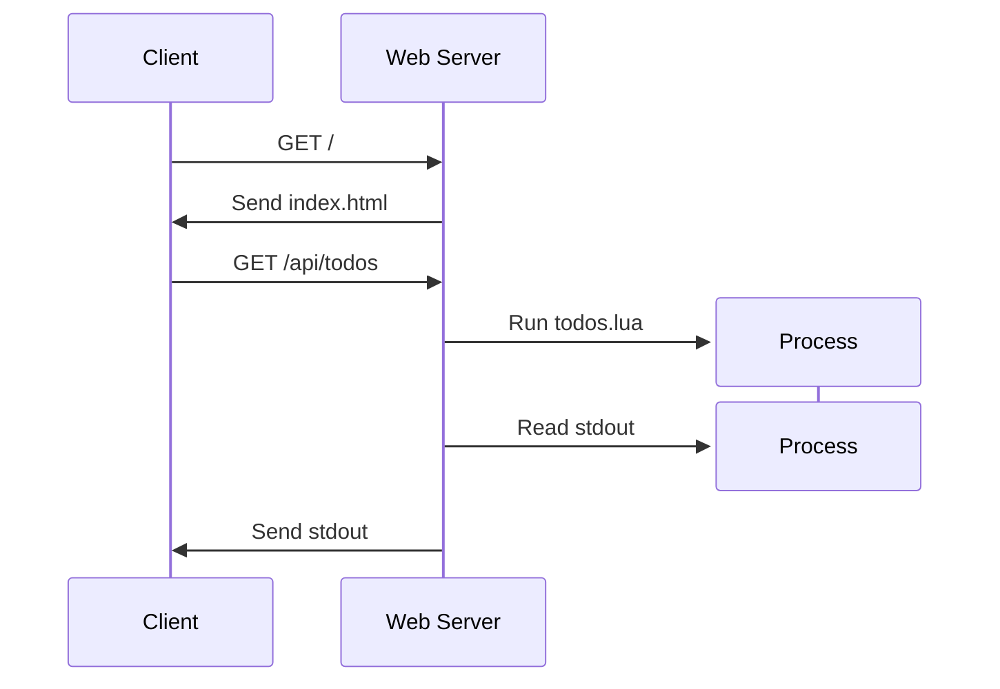

## What is It?

> No, not Computer Generated Images!

A Common Gateway Interface is a specification that enables web servers to execute an external program to respond to HTTP requests.

The TL;DR is that whenever the server gets a web request, we run the corresponding script and capture the output.

## Sequence Diagram of a Request

