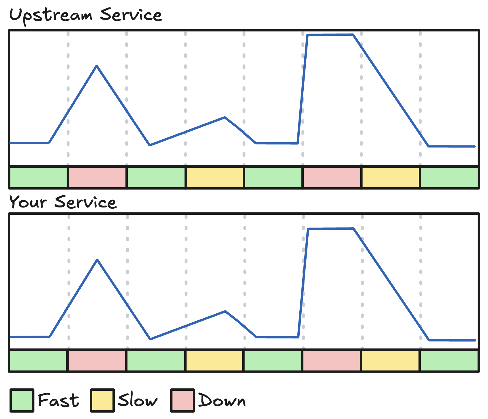
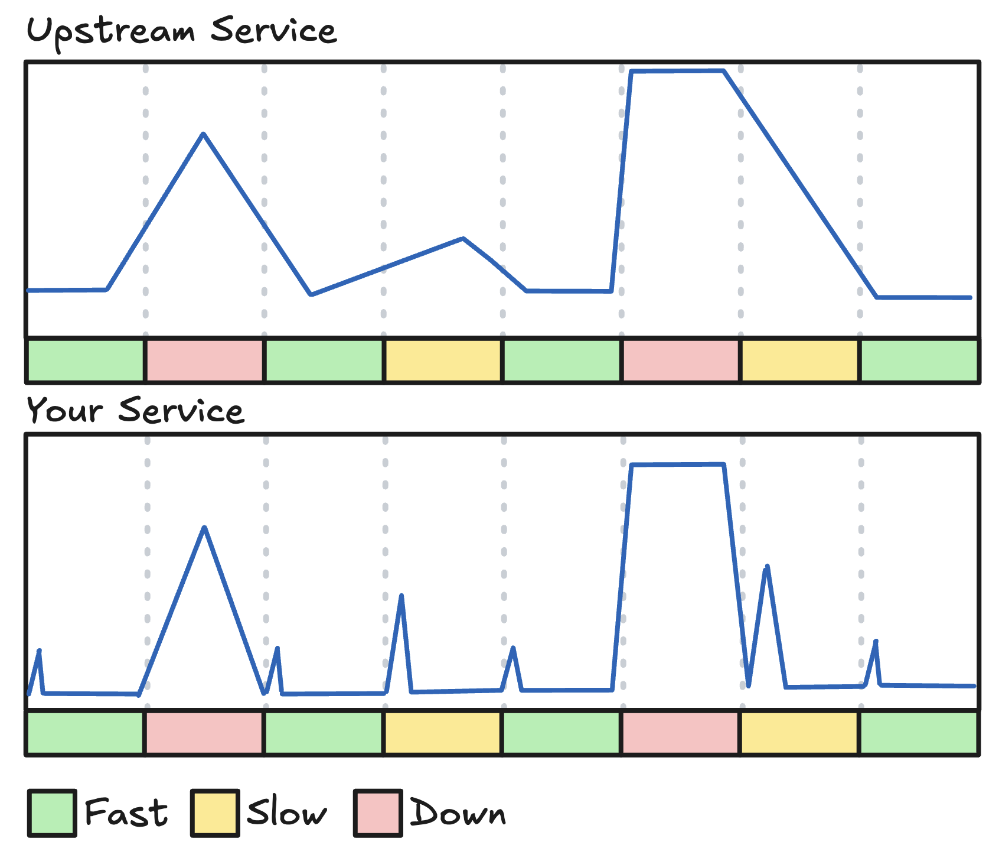
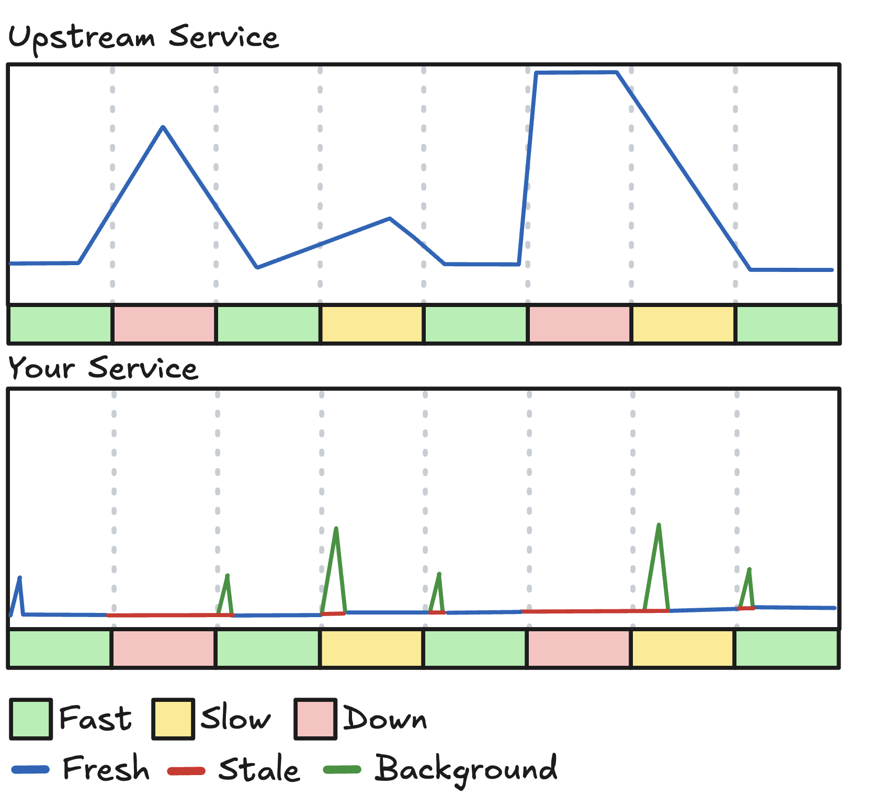
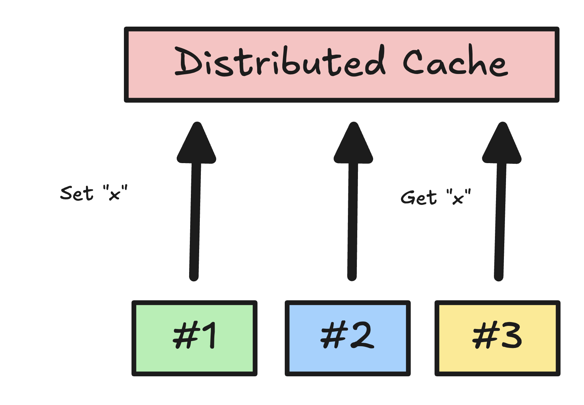
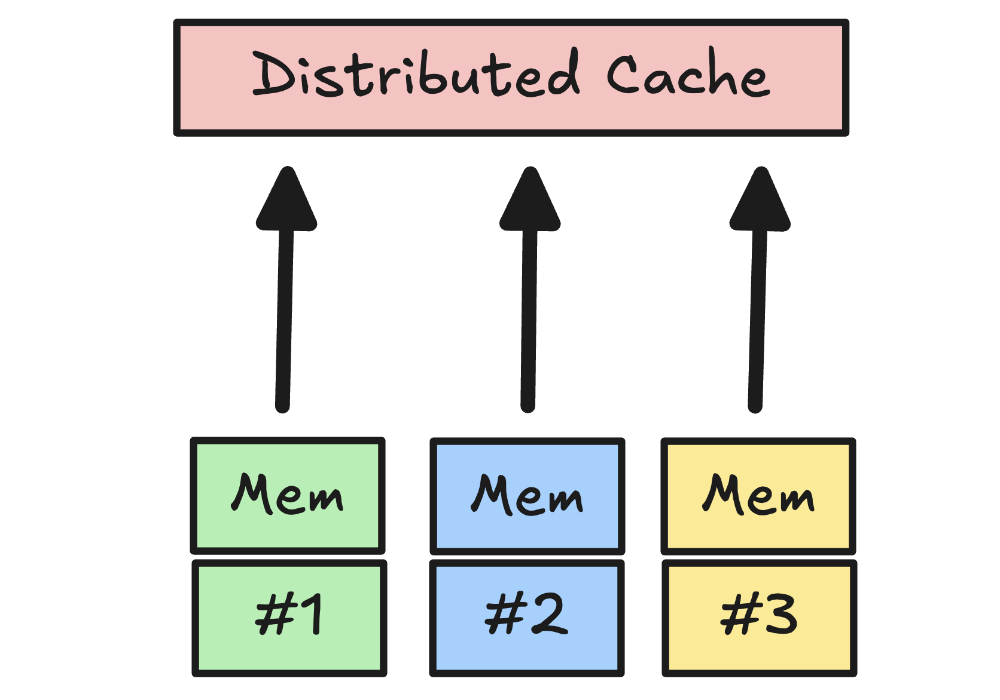
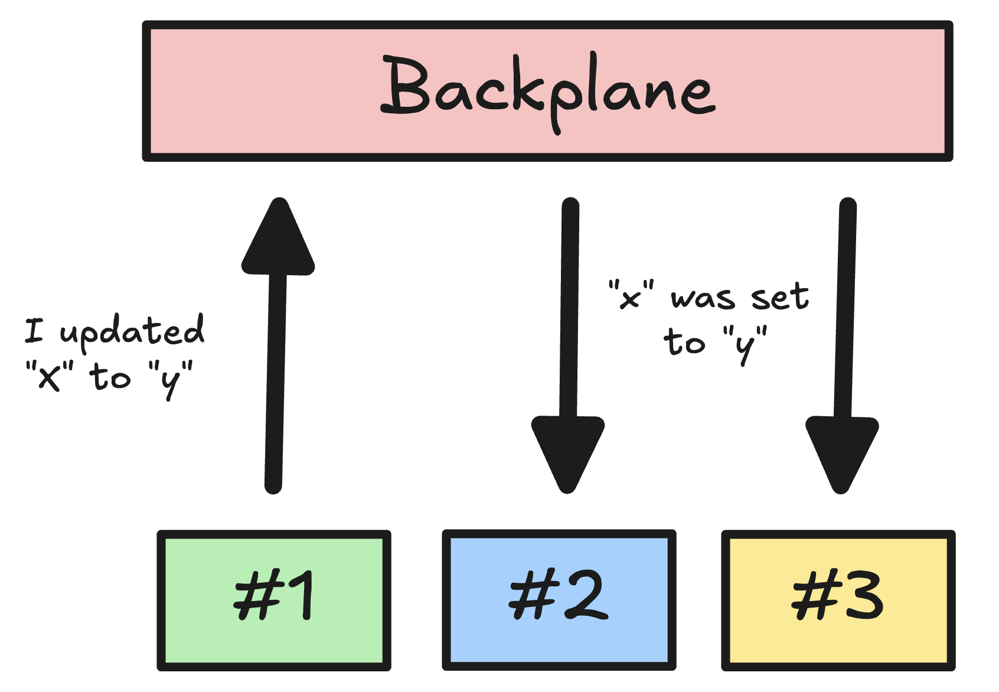

**Target audience**: Developers who shipped a cache, and now have more problems than before they did so.

## Caching is more than just a speed up

It is common pattern to treat caching solely as a latency optimization.
While reducing P95 latency is desirable, in my opinion the most valuable aspect of a cache in a distributed system is **fault tolerance**.

Recently, [in a high-traffic service at Coolblue that I was optimizing](../optimizing-an-express-api-for-10x-perf.md), I implemented some new caching strategies. Some data fetching was moved out of the request scope into background jobs, but not all data was constant. Some data was unique per request and thus had to be fetched during the request.

## 0. No caching

Let's set a baseline. In this hypothetical service we will be optimizing, let's assume all we do is read from our upstream service (which can be a database, API, [pigeon](https://en.wikipedia.org/wiki/IP_over_Avian_Carriers), etc.) and return the result.

Our latency would be equal to the latency of the upstream service, give or take a few milliseconds for request processing. If the upstream is slow, our service is slow. If the upstream is down, our service is down. It's a simple implementation, but not a very robust one.

## 1. Normal caching

At some point, someone will add a cache to this service, likely to speed it up. With a cache between our service and the upstream service, we can minimize the amount of calls we do.

Now our request is really fast, but every once in a while (when the key expires) we have a slow request (equal to our previous normal latency). This request can be even slower when the upstream is slow, but worse, when the upstream is down, our cache stays empty and we are also down.

On a good day, this results in a spikey p99, where every once in a while a request will eat the cost of querying fresh data. On a bad day, we might as well turn the service off because nothing will go through anyway.

## 2. Stale while Revalidate

The issue we now face is that a binary cache state (hit or miss) is insufficient for high-availability systems. It implies that if data is not fresh, the system must query fresh data during the request.

However, for most systems, if the upstream cannot be reached or is timing out, serving stale data is almost always preferable to a 500 error or a timed-out request.

Instead we can treat cache entries with three states:
1.  **Fresh:** Return immediately.
2.  **Stale:** Return immediately, but query in the background.
3.  **Missing:** Query during request.

By splitting a hit into a fresh or a stale value, we can use "expired" data in cases where we have lost our fresh values. So instead of making the request query fresh data, we return just now stale data and trigger a refresh in the background.

This way our requests stay fast and our system is resilient to downtime of the upstream system, we'll just return stale data in that case!

## 3. Thundering Herd Protection

When a hot key expires under load (e.g., 1,000 req/sec) it results in a race condition where all requests miss the cache and hammer the upstream service simultaneously. We call this a thundering herd.

This can be bad for the upstream system, because if it's used to a low amount of requests per second (because you've been caching it), now suddenly their load spikes. Depending on the service they might not be able to scale up fast enough or have a lot of cache misses of their own (if that is the case, just send them this blog post :wink:)

To mitigate this, we can implement **Request Coalescing**. When a (background) refresh is triggered, we flag the key as "inflight". Subsequent concurrent requests for that key do not trigger new fetches; they await the promise/task of the initial fetch, or if available, they return stale data.

<!-- TODO: diagram -->

## 4. Cold Starts

When you use memory caching only and have a lot of data cached, new instances coming online can take a massive latency penalty filling their empty caches.

To prevent this issue, especially in serverless environments, it is common practice to use a distributed cache like [Redis](TODO LINK) instead. A distributed cache can be used by all your instances at the same time and does not empty out when an instance goes down.

However, a distributed cache isn't free. It's a seperate system that can introduce it's own latency, be slow, go down, etc. To mitigate this, we can use both approaches together, having a memory cache per instance and a distributed cache for the whole service.

This means we do double writes (both to memory and the distributed cache) but we can buffer reads. We first check the memory cache, then the distributed cache, then the upstream service (potentially in the background due to having stale data in any of our caches).

Now we have redundancy in place!

## 5. Backplane

Now that we have multiple caches, each with their own lifecycle, split across instances, we have a new problem. What do we do when a cache key needs to be updated? If you only update one instance you might have inconsistencies between instances.

If your keys expire quickly or your data is not very volatile, this might not be an issue, especially if it is not customer facing. For the service I was optimizing it didn't really matter that instance #1 thought a product was 1.01kg but instance #2 got an updated measurement of 1.02kg. This **eventual consistency** was good enough for that system.

However, if you need to minimize this as much as possible (if you can't tolerate it at all, stop caching and just get it from the upstream always), you can use a **Backplane**.

A backplane allows us to communicate with all the instances whenever we do a `SET` in our cache and tell them the `KEY/VALUE` that was updated so they can pro-actively update it instead of waiting for the key to expire.

This is easily implementable using a pub/sub system like Redis (which you probably are using already for the cache, so no extra infra needed!). Every instance subscribes to the same topic and publishes all their `SET`'s on it. Whenever an update comes in, they update their memory cache with the new value.

## Conclusion

This step by step process is also how I optimized our cache implementation.

I was heavily influenced by [FusionCache](https://github.com/ZiggyCreatures/FusionCache), a great implementation of this hybrid caching approach for .NET that I lacked in TypeScript.

So I built my own.

The TypeScript POC for this can be found in the [`tiered-cache` repo on my GitHub](https://github.com/wvanlit/tiered-cache). The final implementation is closed source for now.

### Further reading

- [FusionCache Step by Step](https://github.com/ZiggyCreatures/FusionCache/blob/main/docs/StepByStep.md)
- [Cache Stampede/Thundering Herd](https://en.wikipedia.org/wiki/Thundering_herd_problem)
- [Stale-While-Revalidate (RFC 5861)](https://tools.ietf.org/html/rfc5861)