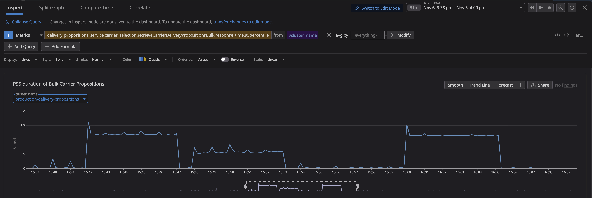
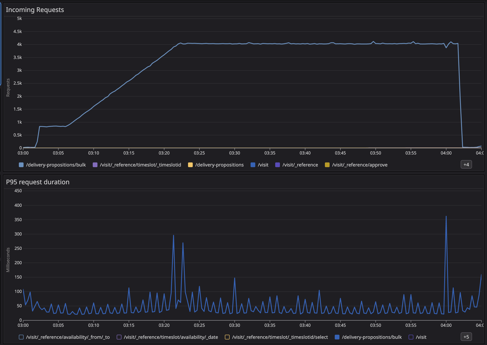

**Who this is for:** You have a Node.js/Express API that works fine on your laptop but falls over in production.

I recently sped up an Express service from **P95 ~1s to ~50ms** and **P99 ~2s to ~100ms**. No rewrite, just asking the same question over and over:

> **What's blocking the event loop right now?**

Everything here comes from one real world scenario, but the ideas are general enough to apply to your own. This post is as much a reference for myself as it is a guide for others. I'll be coming back to this checklist the next time I'm debugging slow requests.

## Why Express APIs get slow

Most Express APIs aren't slow because Node is slow. They're slow because the event loop is stuck doing synchronous work when it should be handling requests.

When this happens, your average response time might look fine, but the slowest 5% of requests (P95) get worse and worse as they wait in line behind whatever's hogging the loop.

If you don't know what's blocking your loop, you're just guessing.

### What I found when I profiled

The first time I profiled this service, about half of every request was spent on `JSON.parse` and `JSON.stringify` for an in-memory cache. Another big chunk was parsing dates over and over. Some time went to setting up new connections for every outbound request. The actual business logic? Barely a blip.

None of the fixes were very surprising. That's the point, this stuff is obvious if you know about it, but it wasn't to me at first.

## 0. Get a baseline you can trust

Before changing anything, make sure your measurements are honest. Performance work is full of "wins" that vanish when traffic changes.

Run your load test for minutes, not seconds, long enough for the system to settle. Decide if you're testing with a warm cache or a cold start, then stick with it. Keep the same mix of requests so you don't accidentally "improve" performance by sending easier traffic.

Most importantly: measure more than just response time. Memory usage, event loop delay, CPU usage, etc. all play a part in optimization, sometimes not at the single request level but over the lifetime of your instance.

On this service, even light load pushed P95 to ~1s and P99 to ~2s, while CPU wasn't maxed out. It showed we were not running out of CPU but instead you're blocked by the event loop. Those requests were waiting behind long running synchronous work.



## 1. Reuse connections (HTTP Keep-Alive)

If your API calls other services, you don't want to set up a new TCP/TLS connection for every request. That overhead adds up, and it makes things worse when you're already under load.

The fix is simple: enable keep-alive and share a connection pool.

```ts
import { Agent as HttpsAgent } from "node:https";

export const httpsAgent = new HttpsAgent({
  keepAlive: true,
  maxSockets: 50,
  maxFreeSockets: 10,
  keepAliveMsecs: 1_000,
});
```

After you ship it, double-check that your HTTP client is actually using the agent (easy to mess up), you're not creating a new agent per request (which defeats the purpose), and the services you're calling don't mind long-lived connections (almost none do).

## 2. Stop serializing in-memory data

Profiling showed something I didn't expect: a huge chunk of request time was spent on `JSON.parse` and `JSON.stringify`, not for network calls, but for an in-memory cache.

This was a sneaky bottleneck. JSON is convenient, but it's synchronous CPU work, and that blocks the event loop.

If the cache never leaves the process, just store the objects directly instead of stringifying them.

One catch: caching object references makes accidental mutation easier. If you go this route, freeze your cached values or be very careful about who touches them. Deep-cloning is safer but adds CPU and memory overhead, which can eat your gains.

(The caching in this service got interesting enough that I wrote a [separate post about it](./beyond-basic-caching).)

## 3. Don't parse the same thing twice (especially dates)

After fixing the JSON issue, the next bottleneck was almost embarrassing: parsing the same strings over and over.

Dates are the classic example. `new Date(isoString)` looks cheap, but it's still real work, and it's synchronous. If you're doing it hundreds of times per request, it adds up fast.

The fix: parse things once when they enter your system, then pass around the parsed values. Keep the hot path working with numbers and objects, not strings.

## 4. Garbage collection is latency

GC pauses block the event loop just like everything else. You'll notice them as periodic latency spikes, or as a service that "gets slower over time" under load.

Two things usually help: (1) allocate less stuff in your hot path, and (2) give your process enough memory so V8 isn't constantly cleaning up.

If you're running in containers, setting V8's memory limit explicitly can help, but test it, it's not magic.

Also: always run with `NODE_ENV=production`. Lots of libraries behave differently without it.

## 5. Watch for memory leaks

Slow P95/P99 often comes with a quieter problem: memory growth. More memory means more GC, which means more latency.

Two issues came up for us:

### Caches that grow forever

Our memory cache (a default [KeyV](https://keyv.org/docs/) cache) just used a `Map` under the hood. If you never evict entries, it will leak memory as expired items are not cleaned up.

### Timers that never get cleaned up

This looks harmless:

```ts
await Promise.race([action, timeoutPromise]);
```

But if `action` wins and you never call `clearTimeout`, the timer sticks around until it fires. Under load, that's thousands of tiny leaks per minute.

The fix: always clean up timers in a `finally` block.

## 6. Profile under real load

The pattern is simple: load test, profile, change one thing, load test again. If you change multiple things at once, you won't know which one helped and you won't be able to fix it when performance regresses later.

Wall-time profiling is especially useful for Node because it shows you exactly what's blocking the event loop. The tools vary (Datadog, Clinic.js, `0x`, `--cpu-prof`), but the questions are the same: Where does time go during slow requests? Is it CPU work, parsing, GC, or connection setup? If you see periodic spikes, do they line up with GC pauses?

## Results

After working through these changes, the service went from **P95 ~1s / P99 ~2s** to **P95 ~50ms / P99 ~100ms**, and stayed stable over longer runs.



The numbers are nice, but the real improvement is operational: fewer timeouts, fewer cascading failures, and scaling that actually makes sense.

### Further reading

- [Node.js event loop guide](https://nodejs.org/en/learn/asynchronous-work/event-loop-timers-and-nexttick)
- [Clinic.js](https://clinicjs.org/)
- [`perf_hooks.monitorEventLoopDelay`](https://nodejs.org/api/perf_hooks.html#perf_hooksmonitoreventloopdelayoptions)
