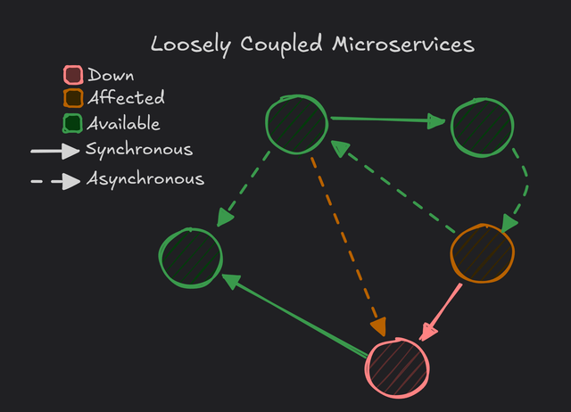
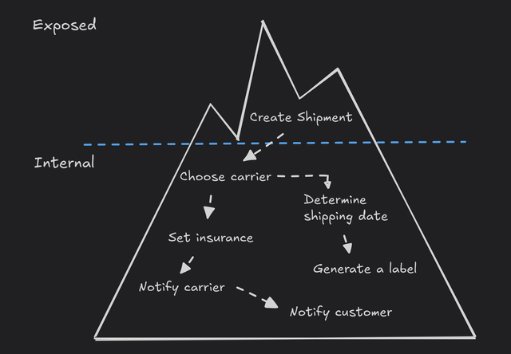

**Target audience**: Product Owners (or anyone else working closely with development teams) in a company with a large technical landscape where multiple development teams operate independently of each other.

## Why Should Product Owners Care About Software Architecture?

It all usually starts with a meeting that goes something like this:
- You propose a shiny new feature or epic, maybe something as simple as showing a user's birthday on the settings page.
- The developers immediately start raising concerns about potential technical pitfalls.
- Terms like **microservices**, **monolith**, and **event-driven architecture** surface before you even finish your sentence.
- Suddenly you're knee-deep in technical jargon.

How on earth does a "Distributed Monolith" make adding a birthday to a simple screen so complicated?[^1] Understanding the fundamentals of distributed software architecture will help you ask the right questions and actually follow the answers.

### Why does this matter to you, as a Product Owner?

- **Impact on Delivery**: Software architecture can dramatically affect how quickly and reliably your team can deliver new features.
- **Scalability and Maintenance**: A complex system with lots of interdependencies can slow down development and lead to constant firefighting.
- **Ownership and Coupling**: Knowing who owns what and how those parts interact helps maintain clear accountability and reduces the risk of finger-pointing when problems arise.

## Ownership: Who Controls What?

In an ideal world, each service in your architecture maps to a distinct business domain or **Bounded Context**[^2] and is owned by a single team. Ownership isn't just about who "wrote the code", it's about ongoing maintenance, support, and strategic improvements.

- **Team Autonomy**: When one team owns a service, they can make decisions quickly and deploy changes without coordinating across multiple groups.
- **Accountability**: Clear boundaries reduce confusion. If the "Shipment Service" fails, there's a go-to team that understands how it works and can address the issue.

Assuming development teams work closely with the business, by architecting around business capabilities we are conforming to [Conway's Law](https://www.wikiwand.com/en/articles/Conway%27s_law).

> Organizations which design systems are constrained to produce designs which are copies of the communication structures of these organizations.
> 
> ~ Melvin E. Conway, How Do Committees Invent?

Shared ownership sounds nice in theory, but too often it results in _no one_ truly owning anything. This leads to slow decision-making and a high risk of knowledge gaps.

_If everyone is responsible, no one is._

### The "Too Many Services" Anti-Pattern

A common trap is splitting a single team's work across _too many_ services. In microservices architecture, people often assume each feature deserves its own service, which can balloon into dozens of services for one team. This fragmentation can lead to:

- **Tight Coupling** among all those mini-services (because each still depends on the others).
- **Deployment Overhead**: More pipelines, more configurations, more complicated rollouts.
- **Reduced Productivity**: Endless context-switching as developers chase bugs across multiple codebases.

So while dividing your system into separate services can help, _more is not always better_. A balanced approach is to have _as few services as needed_ to maintain clear boundaries and ownership without creating unnecessary complexity.

## Coupling: The Hidden Cost of Dependencies

### Tight Coupling

_Tight coupling_ means changes in one part of the system often force changes in another.

For example, that simple request to show a user's birthday requires you to:[^1]
- Call **Bingo** to get the `User Id`.
- Call **Papaya** and **MBS** to turn the `User Id` into a `User Session Token`.
- Validate the `User Session Token` with **LMNOP**.
- Ask **Wingman** if the user is ready to take it to the next level.
- **Wingman** gets a time range between now and the end of the universe from **EKS**.
- **Wingman** asks **Galactus** what all the user info provider services are for that time range.
- Wingman reaches out to the user info providers like **RGS**, **BRB-DLL**, **Ringo 2** and **BLS** to get the birthday of the user.
- **Wingman** returns the user's birthday.

When everything is chained together, a single issue can cascade and cause major outages. If a system needs to change, e.g. moving from **EKS** to **Omega Star**, it could block multiple teams from continuing with their work.

### Loose Coupling

In _loosely coupled_ systems, each service can stand on its own. Modifications to a single service don't automatically break others, and teams can deploy updates independently.

This structure enhances:
- **Reliability**: One service going down doesn't necessarily sink the entire platform.
- **Scalability**: You can scale up or optimize only the services that need it.

### Communication between services

A major driver of coupling is **communication patterns**:
- **Synchronous (Immediate Response)**: This is like a phone call; if the other side doesn't pick up, nothing happens. It's often simpler to implement but can create tight coupling (if one service goes down, the calling service stalls).
- **Asynchronous (Event-Driven)**: This is more like texting. You send a message, and the receiver processes it whenever it's ready. This allows for more resilient and scalable systems, but it's typically more complex to design, especially for user-facing features that need real-time feedback.

## The Evolution of Software Architecture

Most applications begin as a **Monolith**, a single, self-contained system where all business logic resides in one codebase. Over time, as systems grow and new features are developed, someone will go:

At this point developers start splitting the monolith into smaller services. Congratulations, you now have a **Distributed Architecture**. The first step is often a **Distributed Monolith**, different services that appear independent but remain tightly bound together. Eventually, in an ideal scenario, you reach a more **Microservices**-oriented approach, where services are truly independent and loosely coupled.

### Why This Evolution Happens

- **Velocity**: A monolithic approach often becomes unwieldy as the codebase (and developer headcount) grows.
- **Team Autonomy**: Splitting into services can allow different teams to work in parallel if they're truly decoupled.
- **Resilience to problems unrelated to your team**: Independent services can be deployed, scaled, or updated without impacting others, _if_ they're loosely coupled.

But as we'll see, _where you draw those boundaries_ and _how your services communicate_ decide the differences between seamless scaling and a distributed mess.

### Monoliths: The Starting Point

A **Monolith** bundles everything, login, shipping, billing, product listings, etc. into one giant codebase and typically one deployment.

**Pros**:
- **Simplicity**: Only one codebase to deploy and debug.
- **Easy to Develop (Initially)**: Simple local environment: one repository, one set of dependencies.

**Cons**:
- **Slower Deployments**: Large codebase means you need to test everything even if you change only a small part.
- **Ownership Conflicts**: Multiple teams stepping on each other's toes.
- **Limited Scalability**: Scaling means you scale the entire system, even if only one feature needs more capacity.

Most companies start here because it's straightforward. Problems arise as the application, and the organization, grow.

### Microservices: Freedom or a Maintenance Nightmare?

**Microservices** are small, independently deployable services that revolve around business capabilities and are _loosely_ coupled. Each service owns its domain logic, data, and external interfaces.

**Pros**:
- **Team Autonomy**: A team can independently develop, deploy, and scale its microservice.
- **Resiliency**: A failure in one microservice doesn't necessarily bring down others.
- **Scalability**: You can scale up just the services under heavy load.

**Cons**:
- **Operational Overhead**: You now have multiple deployments, monitoring dashboards, pipelines, etc.
- **Complexity in Communication**: As you split into many services, communication paths multiply.
- **Debugging**: Tracing a user action that spans multiple services can be challenging.

#### The Iceberg Principle

Your microservice's **API** should be the tip of the iceberg, a simple interface that hides all the depth underneath. For example, a `Create Shipment` API call might do all the following _internally_:
- Choose a carrier based on cost and coverage.
- Determine shipping schedule.
- Set the insurance value.
- Generate a shipping label.
- Notify the external transport partner about the shipment.
- Send a tracking email to the customer.

All that logic remains _inside_ the "Shipment" service. You keep the external interface lean, and the user doesn't need to call five different microservices to get one action done.

If at any point you want to pull out one of these sub-systems into its own service (e.g. creating an email sending service) you can do so without changing the external API.

## The Distributed Monolith: A System That Pretends to Be Microservices

After outgrowing the monolith, the next logical step is splitting off parts of the application into separate services. But if those new services remain **tightly coupled**, you don't really gain the benefits of microservices.

### Symptoms of a Distributed Monolith

- **Multiple Deployments, Single Point of Failure**: Even though you deploy 10 different services, if one of them crashes, everything stops working.
- **Cascading Failures**: A seemingly small issue in the "Order Service" might trigger a meltdown in "User Profile," "Notification," and "Invoice" services.
- **Excessive Cross-Service Calls**: Retrieving basic data (like a user's birthday) requires multiple network hops.

In many cases, a Distributed Monolith is actually _worse_ than a single monolith. You have all the overhead of multiple services, but with none of the independence.

## Conclusion

- **Monolith -> Distributed Monolith -> Microservices** is a common path but not always a straight line.
- **Clear Ownership** is essential. Each service should have a dedicated team that fully owns and understands it.
- **Loosely Coupled** services enable teams to work independently without waiting on each other.
- **More Services != Better Architecture**: Don't fall into the "just keep splitting it up" trap. Each new service introduces overhead.
- Aim for a balanced approach, **the right number** of services with well-defined boundaries.

Hopefully, this overview helps you navigate those technical discussions with more confidence. By recognizing how monoliths, distributed monoliths, and microservices differ, and why those differences matter, you'll be better positioned to lead your team to scalable, maintainable success.

### Further Reading & Listening
- [Microservices.io](https://microservices.io/) by Chris Richardson
- _Designing Data-Intensive Applications_ by Martin Kleppmann
- _Microservices Patterns_ by Chris Richardson
- [Don't Build a Distributed Monolith](https://www.youtube.com/watch?v=p2GlRToY5HI) by Jonathan Tower
- [Design more decoupled services with one weird trick](https://www.youtube.com/watch?v=mT5bhj1Wygg) by Udi Dahan

## Footnotes

[^1]: If you don't get the reference, [this video](https://www.youtube.com/watch?v=y8OnoxKotPQ) is a mandatory watch for anyone dealing with a distributed system landscape.
[^2]: See [Martin Fowler's description of Bounded Contexts](https://martinfowler.com/bliki/BoundedContext.html) for a deeper dive into how to define logical boundaries in complex systems.
